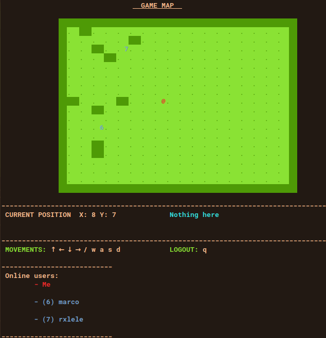

# **WIP AT THE MOMENT**

# Terminal Race

Client-server game based on TCP sockets

## Disclaimer

This project was made for academic purpose only. No changes will be applied to any file present in this repo.

## Description

The aim of the project is to make a client-server game in which multiple users challenge each other to reach a destination. The language used in the project is C on UNIX platform. Processes use TCP sockets to communicate. The game *(ops, you lose)* runs on terminal.

The map created by the server will be populated with invisible walls. Players can move in one of the four directions (up, down, left, right). Every player will be put in a random position at the beginning of the game. Every player can see the destination and other players as well. When a player discover a wall, it becomes visible for all players. The game ends when a player reaches the destination. There's no time limit.

Users will have to register to the game using username and password in order to play.

The game works only on UNIX machines. It will not work on Windows natively. Not tested on macOS. The games uses UNIX system calls only, as well as other system libraries (no ncurses, etc.).

The game works locally using multiple terminal windows. If you open port ```x``` on your machine you can join the game via port ```x``` from other machines as well.

## Usage

Compilation
```sudo chmod +x compile.sh && ./compile.sh```

Server start
```./server [port]```

Client start
```./client [IP address] [port]```

## Game screen


